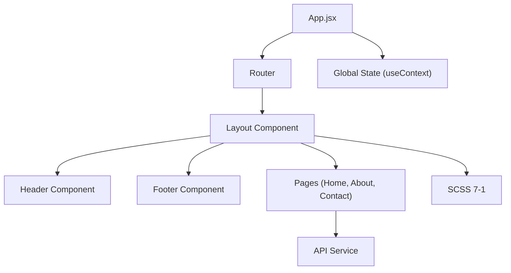

---


# 🚀 Mon projet React Vite


Application frontend moderne avec :

- React
- Vite
- SCSS (pattern 7-1 + BEM)
- ESLint + Prettier
- Husky + Commitlint
- GitHub Actions
- Mermaid diagrams

---

## 📦 Installation

npm install

##🧩 Scripts disponibles
Commande Description
npm run dev Lancer le serveur de développement
npm run build Build de production
npm run preview Prévisualisation du build
npm run lint Lint JavaScript avec ESLint
npm run lint:fix Lint + correction automatique
npm run lint:scss Lint SCSS avec Stylelint
npm run lint:scss:fix Lint SCSS + correction automatique
npm run format Formatage Prettier
npm run daily:commit Lancer le script de daily commit interactif

##🧪 Qualité du code

Lint JS : config Airbnb + Prettier
Lint SCSS : BEM + nesting max 2 niveaux
Prettier : formatage homogène
husky : hooks pré-commit et commit-msg
Commitlint : Conventional Commits

##🌱 Structure du projet

root/

```
src/
└── styles/
    ├── abstracts/      // variables, mixins, fonctions
    ├── base/           // reset, typographie
    ├── components/     // éléments UI BEM (boutons, cartes, etc.)
    ├── layout/         // header, footer, grid
    ├── pages/          // styles spécifiques aux pages
    ├── themes/         // dark/light mode (optionnel)
    └── vendors/        // styles externes ou lib CSS
```

docs/ # Documentation Markdown + Mermaid
.husky/ # Hooks Git
scripts/ # Scripts personnalisés

##📝 Rédaction des commits

Nous utilisons le format Conventional Commits :

<type>(<scope>): <description>
Types recommandés :

feat: ajout de fonctionnalité
fix: correction de bug
docs: documentation
refactor: refactoring
chore: tâches annexes

Exemple :

feat(flag:search-toggle): ajout du moteur de recherche masqué

##🧭 Diagrammes d'architecture
Les diagrammes Mermaid sont dans /docs.

Exemple de rendu :



##⚙️ CI / CD
Le pipeline GitHub Actions :

s'exécute sur chaque push et pull_request
vérifie :

Lint JS
Lint SCSS
Formatage Prettier

##✨ Scripts personnalisés

✅ Daily Commit
Pour faciliter le commit quotidien :

./scripts/daily-commit.sh
Le script vous demande si la feature est derrière un flag et génère le message de commit automatiquement.

##🚀 Démarrer le projet

npm run dev

##🛡️ Sécurité

rel="noopener noreferrer" sur tous les liens externes
Aucun secret dans le code source
Revue obligatoire avant merge

##📈 Evolutions prévues

Tests unitaires avec Jest
CI/CD complet avec déploiement
Documentation des composants Storybook

## 📚 Liens utiles

- [Documentation React](https://react.dev/)
- [Guide officiel Vite](https://vitejs.dev/guide/)
- [Guide Sass (7-1)](https://sass-guidelin.es/#architecture)
- [JSDoc Cheatsheet](https://devhints.io/jsdoc)
