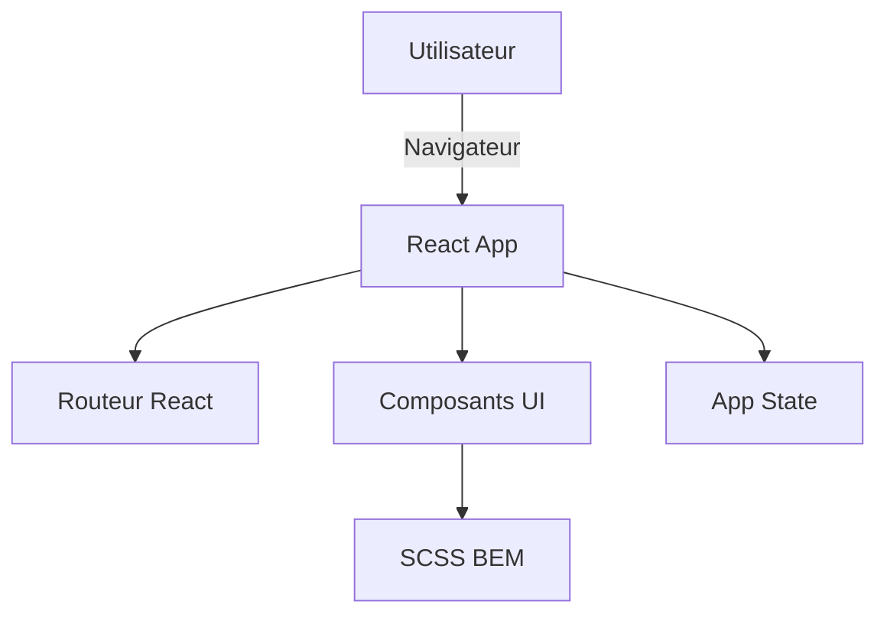
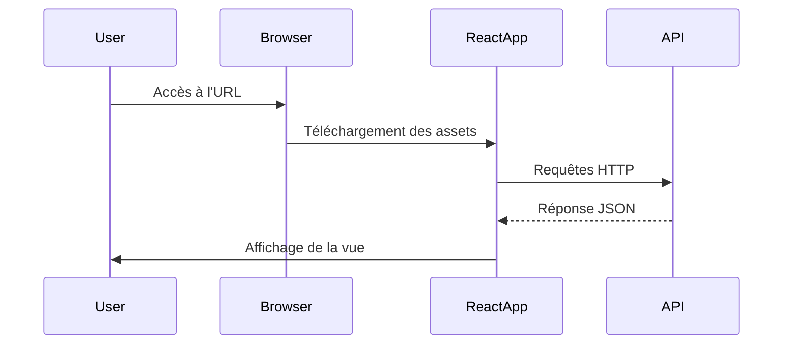

# 🏗️ Architecture du projet

Ce document décrit l'architecture technique du projet **[NOM DU PROJET]**.

---

## 🌿 1. Objectifs du projet

- **But principal :** Créer une application React avec Vite et SCSS BEM.
- **Stack technique :**
  - React
  - Vite
  - SCSS (pattern 7-1)
  - ESLint + Prettier
  - Husky + Commitlint
  - GitHub Actions (CI/CD)

---

## 📂 2. Structure des dossiers

root/
src/
components/ # Composants React réutilisables
styles/ # Fichiers SCSS (BEM + 7-1)
App.jsx # Composant principal
main.jsx # Entrée de l'application
public/ # Fichiers statiques
docs/ # Documentation et diagrammes
.husky/ # Hooks Git

## 🧩 3. Schéma de composants



## 🔄 4. Flux de données



## 🧱 5. Conventions de développement

JavaScript & React
Linting : Airbnb config

Formatage : Prettier

Nommage des composants : PascalCase

Imports : Chemins relatifs

SCSS
Pattern : 7-1

Nommage : BEM (block\_\_element--modifier)

Nesting max : 2 niveaux

## 🧪 6. Qualité et automatisation

ESLint : npm run lint

Stylelint : npm run lint:scss

Prettier : npm run format

Husky : pré-commit et commit-msg hooks

Commitlint : Conventional Commits

CI/CD : GitHub Actions (build + lint)

## 🔒 7. Sécurité

Utilisation de rel="noopener noreferrer" sur les liens externes

Aucune donnée sensible versionnée

Revue de code obligatoire avant merge sur main

## 📈 8. Évolutions prévues

Ajout de tests unitaires avec Jest

Intégration continue sur GitHub Actions

Documentation complète des composants

## 🔗 9. Liens utiles

[Documentation React](https://react.dev/)

[Documentation Vite](https://vitejs.dev/)

[Guide Airbnb JavaScript](https://github.com/airbnb/javascript)

[Conventional Commits](https://www.conventionalcommits.org/fr/v1.0.0/)

Document maintenu par l'équipe de développement.

```

```

```

```
